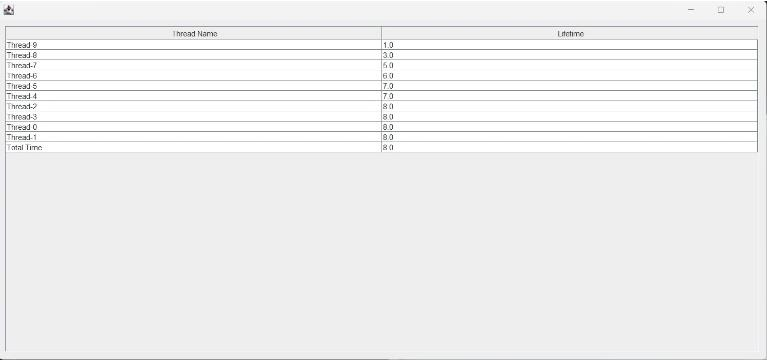

# Detection of Similar Records with Multithreading in Big Data (Büyük Veride Multithreading ile Benzer Kayıtların Tespit Edilmesi)

***Müşteri*** ***şikayetleri*** ***kayıtlarının*** ***tutulduğu***
***bir*** ***veri*** ***seti*** ***içerisindeki*** ***benzer***
***kayıtlar*** ***tespit*** ***edilecek*** ***ve*** ***tespit***
***edilen*** ***kayıtlar*** ***masaüstü*** ***uygulamasında***
***gösterilecektir.*** ***Multithreading*** ***kullanarak***
***benzerlik*** ***arama*** ***süresini*** ***düşürmek***
***amaçlanmaktadır.***

***Anahtar*** ***Kelimeler:*** ***multitasking,*** ***multithreading,***
***threshold,*** ***thread,*** ***stopwords,*** ***database***

**Projenin** **Özeti**

Yazılım laboratuvarı 1 projesi olarak bizden "Büyük Veride
Multithreading ile Benzer Kayıtların Tespit Edilmesi" adındaki bir
uygulama yapılması istendi. Bize projeyi tanıtan pdfte açıklanan 6
isteri uygulamaya çalıştık.

Biz bu proje için bizden istenenler doğrultusunda programlama
dillerinden Java, C#, Python vb. dilleri arasından Java'yı, database
olarakta MYSQL kullanmayı uygun gördük.

Projemizin isterleri üzerine 1 milyon üzerinde veri içeren Consumer
Complaint Database adlı database de bulunan 18 sütun ve stopword ler
proje tanıtım pdf teki isterler üzerine düzenlenip 6 sütun ve
stopwordlerden arındırılmış bir hale getirdik. Tasarladığımız ara yüzden
programın çalışması için gerekli olan thread sayısını, benzerlik oranını
ve karşılaştırılacak olan sütunu alıp kullanıcının seçeceği senaryoya
göre uygun sonuçları bir tabloda gösterdik ve her bir thread in çalışma
süresini de bir tablo üzerinde gösterdik.

> **I.** **GİRİŞ**

Projenin konusu "Büyük Veride Multithreading ile Benzer Kayıtların Tespit
Edilmesi" adındaki bir uygulama yapılması istendi. Bize projeyi tanıtan
pdfte açıklanan 6 isteri uygulamaya çalıştık.

Biz bu proje için bizden istenenler
doğrultusunda programlama dillerinden Java, C#, Python vb. dilleri
arasından Java'yı, database olarakta MYSQL kullanmayı uygun gördük.

> **II.** **YÖNTEM**

Bu projede kullanılan yöntem 3 aşamada anlatılacaktır.

1.Aşama: Öncelikle pdf te verilen verilerin bulunduğu siteden veri
setini düzenlemek ve stopwordsleri kaldırmak için veriyiverilen bağlantıdan indirdik. Bu veri seti .csv formatında bulunduğu
için bunu daha verimli düzenleyip kullanabilmek için bunu Mysql
veritabanına aktardık. Bizden bu veri setini projede bize gerekli olan 6
sütuna göre düzenledik. Sonrasında verilerdeki stopwordsleri temizlemek
için Python için kullanılan nltk kütüphanesinin içinde bulunan
stopwordsleri alıp database stop adında bir tablo oluşturup içine
ekledik. Daha sonra Java'da yazdığımız kodlarla düzenlediğimiz 6 sütunlu
veri setindeki stopwordsleri, stop tablosundaki kelimelerle
karşılaştırarak daha sade hale getirdik. Böylelikle verilerimizden
stopwords ve noktalama işaretlerinden arınmış oldu.

Veri seti aşağıdaki kurallara uygun olacak şekilde yeniden düzenlendi:

○ Elde edilen tabloda 6 farklı sütun bulunmaktadır: Product (Ürün),
Issue (Konu), Company (Şirket), State, Complaint ID, Zip Code.

○ Null değer içeren kayıtlar bulunmamaktadır.

○ Kayıtlardaki noktalama işaretleri kaldırılmıştır.

○ Kayıtlardaki stop word'ler kaldırılmıştır. (nltk kütüphanesinden
faydalanıldı).

2.Aşama: Projede verilen örnek senaryoların gerçekleşmesi için bir
arayüze ihtiyacımız vardı. Arayüz tasarımı için örnek senaryoları
inceledik. Örnek senaryolar :

• Senaryo 1: Ürün (Product) sütununda %60 ve üzeri benzer olan kayıtları
ekranda gösteriniz.

• Senaryo 2: Aynı ürünler (Product) için %70 ve üzeri benzerlikteki konuları (Issue) içeren Şirket (Company)
isimlerini ekrandagösteriniz.

• Senaryo 3: 'Complaint Id' = 3198084 olan şikayet kaydı için % 50 ve
üzeri benzerlikteki konuları (issue) içeren kayıtları ekranda
gösteriniz.

• Senaryo 4: 5 Thread ile Konular(Issue) sütununda %80 ve üzeri benzer
olan kayıtları ekranda gösteriniz

Buradaki Senaryo 1 ile Senaryo 4 birbirinin benzeri olduğundan bu
isterleri çalıştırmak için arayüzün sol tarafında bulunan 3 adet isteri
eksiksiz ve doğru girdikten sonra "only rate and column" adlı butona
basarak sonuç tablosu ve çalışma zamanı tablosunu görüntüleyebiliriz.

Senaryo 2 için ise yine temel 3 isteri doğru ve tam girdikten sonra
"custom save" butonuna tıklıyoruz. Sonrasında açılan 2.pencerede hangi
sütunda ki verilerin aynı kalmasını istiyorsak onu ve bu verinin isminin
ne olduğunu textField alanına giriyoruz ve sonuç tablosunda bu
isterleirn çalışması sonucunda hangi bilginin basılmasını istiyorsak o
sütunu seçiyoruz. En sonunda "onayla" butonuna bastığımızda sonuç
tablosu ve çalışma zamanı tablosu önümüze gelecektir.

Senaryo 3 için, yeniden temel olan 3 isteri girdikten sonra açılacak
olan küçük pencerede ana arayüzde karşılaştırmak istenen sütundaki
istenen verinin id si girilip "onayla" butonuna basıp sonuçları
görebilmekteyiz.

3.Aşama: Arayüzden girilen thread sayısınca thread oluşturulup
databasede istenen verilerin filtrelendiği bir algoritma kuruldu.

Oluşturulan Classlar :

> • admin.java
>
> • Baglantı.java
>
> • DbConnection.java • GetRequest.java
>
> • IdInput.java • Main.java
>
> • ResultTask_2.java • Scenario_1.java
>
> • Scenario_2.java • Scenario_3.java • Task_1.java
>
> • Task_2.java 
> 
> • Task_3.java
>
> • ThreadTime.java

Kullanılan programlar: Eclipse, Mysql

> **SÖZDE** **KOD**

 1-BAŞLA

 2-Thread sayısını oku

 3-Benzerlik oranını oku
 
 4-Karşılaştırılmak istenen sütunu oku

5-EĞER 1.butona tıklandıysa GİT satır

6- Senaryo_1 ve Task_1 classlarını çalıştır GİT satır 11

7- EĞER 2.butona tıklandıysa GİT satır 8

8- Senaryo_2 ve Task_2 classlarını çalıştır GİT satır 12

9- EĞER 3.butona tıklandıysa GİT satır 10

10- Senaryo_3 ve Task_3 classlarını çalıştır GİT satır 11

11- admin classına sonuçları gönder

12-ResultTask_2 classına sonuçları gönder

13-YAZ tablo

14-BİTİR

> **III.** **DENEYSEL** **SONUÇLAR**

> **KAYNAKLAR**

● https://mertmekatronik.com/thread-ve-multithread-nedir

● https://www.tutorialspoint.com/operating_system/os\_multi_threading.html

● https://www.javatpoint.com/multithreading-in-java

● https://totalview.io/blog/multithreading-multithreaded-applications#:\~:text=Multithreading%20is%20a%20model%20of,to%20their%20own%20CPU%20core.

● https://stackoverflow.com/questions/33944872/import-big-csv-file-into-mysql)

● Intro to Java Programming, Comprehensive Version (10th Edition) Y.
Daniel Liang

● Veritabanı Mantığı Kerem Köseoğlu

> **IV.** **SONUÇ**

Bu projede stopwords kavramını öğrendik. Thread kavramı hakkında birçok
yeni bilgi edindik.

Multithreading (çok iş parçacıklı çalışma), bir merkezi işlem biriminin
(CPU) (veya çok çekirdekli bir işlemcideki tek bir çekirdeğin) aynı anda
işletim sistemi tarafından desteklenen birden çok yürütme iş parçacığı
sağlama yeteneğidir.
Bu tür programlamada birden çok iş parçacığı aynı anda çalışır. Çok iş
parçacıklı model, sorgulamalı olay döngüsü kullanmaz. CPU zamanı boşa
harcanmaz.Boşta kalma süresi minimumdur. Daha verimli programlarla
sonuçlanır. Herhangi bir nedenle bir iş parçacığı duraklatıldığında,
diğer iş parçacıkları normal şekilde çalışır.
